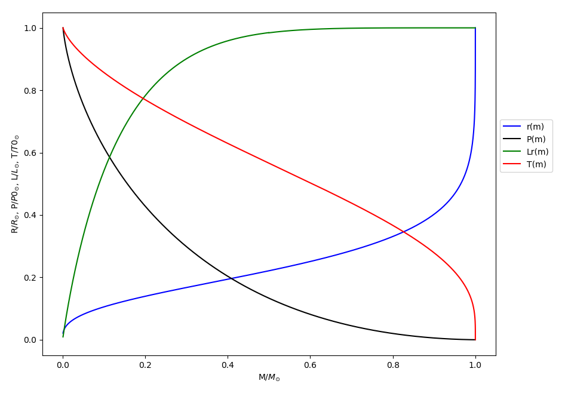
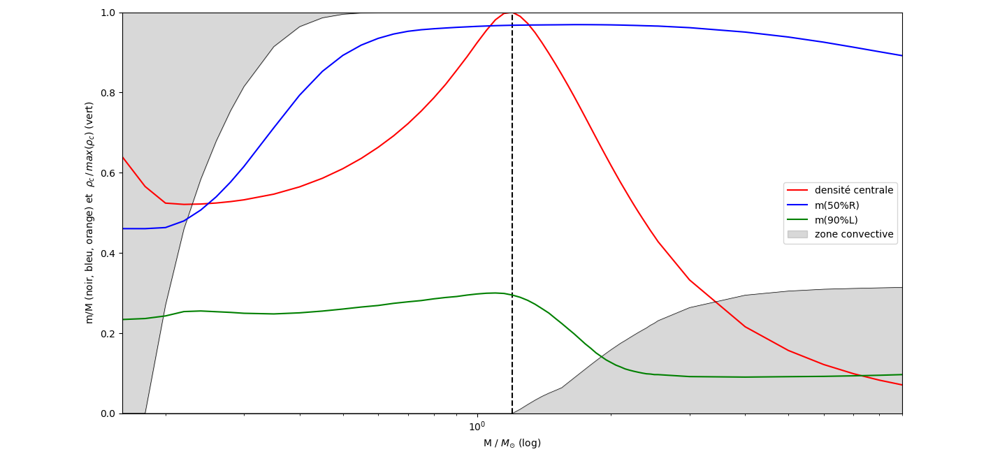
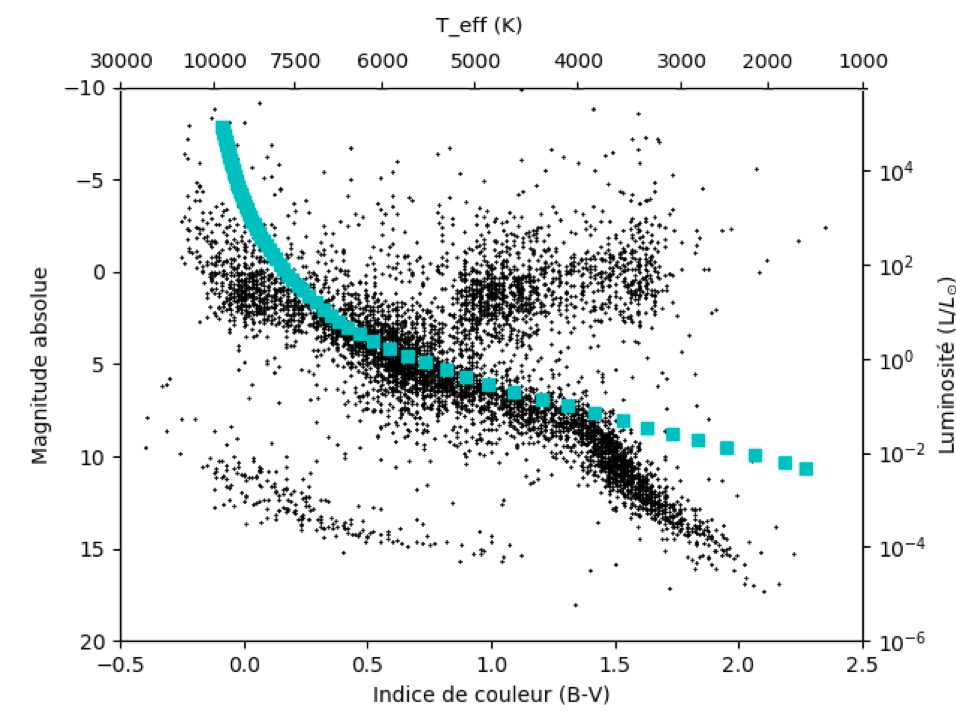
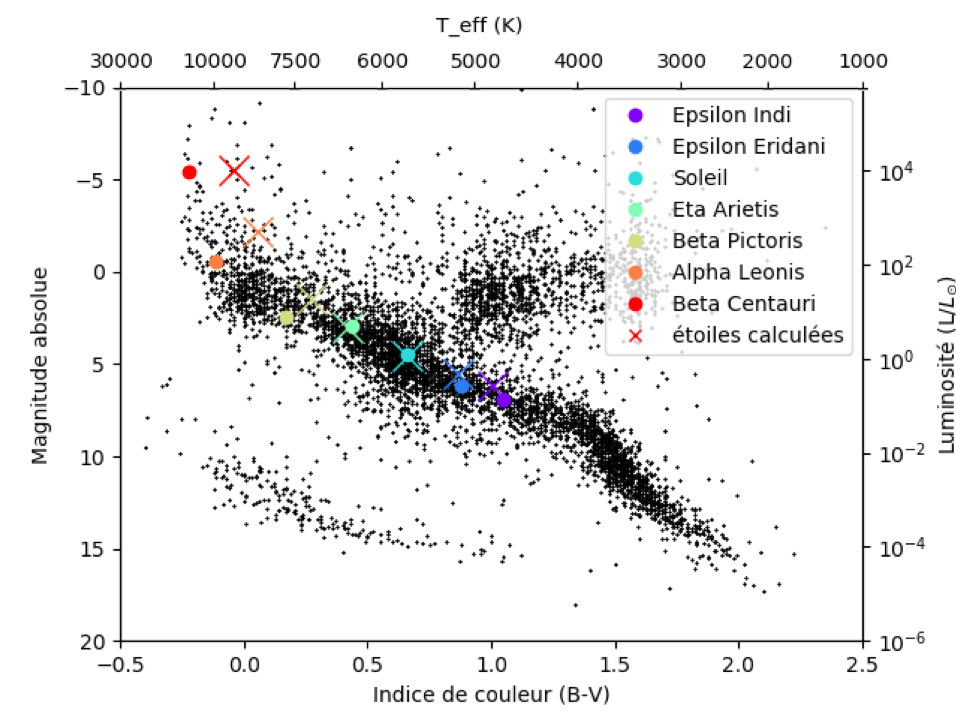

# Hydrodynamique dans l'approximation quasi-statique : structure interne des etoiles

Ce projet consiste a modeliser l'interieur des etoiles de la sequence principale
ainsi qu'a explorer l'influences des differents parametres physiques et numeriques.

Une serie de parametres peuvent etre modifies au sein meme du programme, pour obtenir les resultats demandes.

Des graphiques pour quelques simulations differentes sont inclus : Graphiques de sequence principale, graphiques pour l'interieur d'une etoile de M masse solaire etc.

---

## Controle des graphs et parametres physiques :
 lignes 421 a 474 du programme

---

## Liste des possibilites :

* `opak` : definition complete de l'opacite

* `rad_conv` : convection possible dans l'etoile

&nbsp;

* `Fit_method` : une des 2 principales option, permet l'integration pour une masse a choisir

> * `Pct` : point de rencontre des deux integrations

> * `evo_yi_i` : visualisation de l'evolution des conditions initiales au cours de Fit_method

> * `mutliP_sep_var` : visualisation de l'evolution des variables au cours de la Fit_method

> * `visu_opacity` : opacite de l'etoile

> * `grad_T` : gradients de temperature dans l'etoile

&nbsp;

* `Multi_fit` : deuxieme principale option, permet la creation du diagramme H-R et autres graphs utilisant plusieurs masses

> * `H_R` : creation du diagramme de Hertzsprung Russell

> *	`some_stars` : diagramme H-R avec 7 etoiles connues (dont le Soleil)
	
> * `Rho_c_M` : densite centrale en fonction de la masse
	
> * `visu_reg` : visualisation des zones convectives et autres donnees
	
> * `ecart_yi` : modifications dans les conditions initiales au cours des integrations en fonction de la masse de l'etoile (assez long puisque les modifications doivent toutes etre les memes peu importe la masse)

* `multi_pct` : Fit_method avec differents points de rencontre 

* `change_compos` : changement dans la composition de l'etoile (choisir de changer X ou Z)

* `PP_CNO` : graphique des taux de production d'energie

* `simple_odeint` : simple integration avec les conditions initiales deja pre-definies pour une etoile de la masse du Soleil

* `info` : pour avoir des informations physiques et numeriques sur l'integration effectuee

* `precis_up` : pour obtenir une meilleure precision sur le resultat, le temps de traitement en est augmente (utile pour visu_reg pour voir l'enveloppe convective du Soleil)

* `animated` : pour voir en direct l'evolution de la structure interne avec Fit_method

* `time` : obtenir le temps d'execution du programme

Remarque : la plupart des fonctions (notamment dans `Multi_fit`, `multi_pct` et `change_compos`) sont a utiliser avec `opak==True` et `rad_conv==True`.

---

## Cas restrictifs :

Le modele fonctionne pour un grand nombre de masses mais celles-ci ont des limites en fonction des parametres physiques actives (voir partie suivante).

Eviter d'activer `Fit_method` et `Multi_fit` en meme temps pour ne pas avoir de conflit dans les resultats.

`opak==True` et `rad_conv==False` pas compatible donc l'integration ne marche pas.

---

## Etendue de la validite des modeles (masses calculables) :
 

`opak` | `rad_conv` :

 `True`  | `True`    :  entre 0.16 et 37.9 masses solaires

 `False` | `True`    :  entre0.0006 et 38.3 masses solaires

 `False` | `False`   :  entre 0.9 et 2.8 masses solaires

---

Du fait de la non linearite des equations et du fait quelles soient couplees, l'integration peut etre compliquee et un message d'avertissement provenant du module `scipy`  s'affiche. Pour ne pas etre importune par ce message, des definitions qui suppriment ces messages ont ete ajoutees au programme : `fileno` et `stdout_redirected`.

---

Le fichier starsdata.txt (donnees du diagramme H-R) comporte : 

* colonne 1: numero d'identification de l'etoile
* colonne 2: magnitude apparente, V
* colonne 3: couleur observee, B-V
* colonne 4: parallaxe observee (arcsec)
* colonne 5: incertitude dans la parallaxe (milliarcsec)

---

## Exemple de resultat :

Structure interne d'une etoile :

Densite centrale, fractions massiques et zones convectives en fonction de la masse de l'etoile :

Diagramme de Hertzprung-Russel pour des etoiles couvrant une bonne partie du spectre des possibilites :

Diagramme de Hertzprung-Russel avec 7 etoiles connues et leurs correspondantes calculees :

